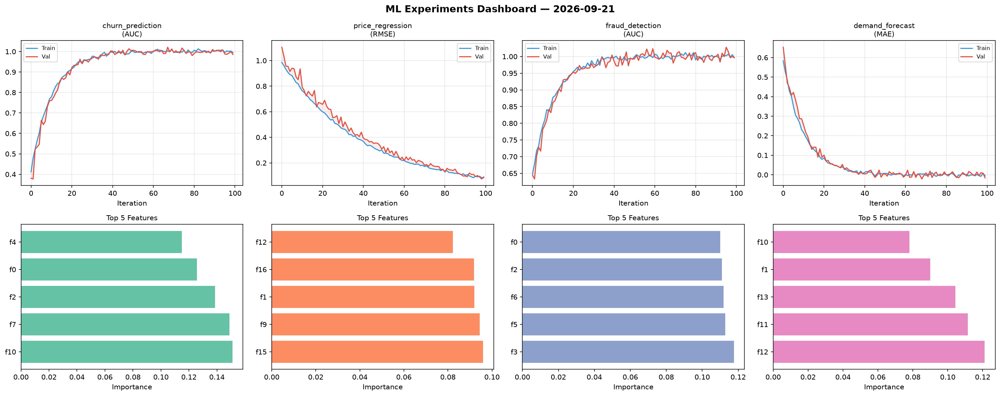
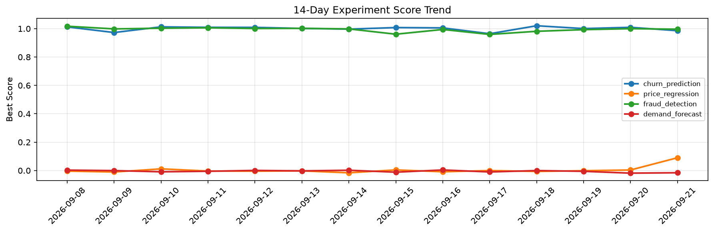

# ML Experiments Report — 2026-09-21

**Run ID:** `dd91b737cc` | **Experiments:** 4 | **Trials:** 17

## Delta vs Yesterday

| Experiment | Today | Yesterday | Change |
|-----------|-------|-----------|--------|
| churn_prediction | 0.9856 | 1.0094 | 📉 -2.4% |
| price_regression | 0.0901 | 0.0038 | 📈 2271.1% |
| fraud_detection | 0.9963 | 0.9999 | 📉 -0.4% |
| demand_forecast | -0.0157 | -0.0184 | 📈 14.7% |

## churn_prediction (AUC)

**Best Score:** 0.9856 (Trial 3)

| Trial | Score | Overfit Gap | Time | LR | Trees | Leaves |
|-------|-------|-------------|------|-----|-------|--------|
| 1 | 0.7929 | 0.009 | 8.66s | 0.01 | 100 | 15 |
| 2 | 0.781 | 0.0169 | 129.3s | 0.01 | 1000 | 127 |
| 3 ⭐ | 0.9856 | 0.0097 | 137.41s | 0.2 | 1000 | 15 |
| 4 | 0.9375 | 0.0403 | 32.83s | 0.05 | 200 | 15 |
| 5 | 0.9557 | 0.004 | 25.87s | 0.05 | 500 | 63 |

## price_regression (RMSE)

**Best Score:** 0.0901 (Trial 1)

| Trial | Score | Overfit Gap | Time | LR | Trees | Leaves |
|-------|-------|-------------|------|-----|-------|--------|
| 1 ⭐ | 0.0901 | 0.0067 | 51.06s | 0.05 | 200 | 63 |
| 2 | 0.1055 | 0.0116 | 12.38s | 0.05 | 100 | 63 |
| 3 | 0.1521 | 0.0147 | 22.77s | 0.05 | 100 | 31 |

## fraud_detection (AUC)

**Best Score:** 0.9963 (Trial 6)

| Trial | Score | Overfit Gap | Time | LR | Trees | Leaves |
|-------|-------|-------------|------|-----|-------|--------|
| 1 | 0.6014 | 0.0477 | 63.64s | 0.01 | 500 | 127 |
| 2 | 0.989 | 0.0138 | 99.06s | 0.2 | 500 | 127 |
| 3 | 0.9746 | 0.0176 | 9.81s | 0.05 | 100 | 31 |
| 4 | 0.9809 | 0.0216 | 73.03s | 0.2 | 500 | 63 |
| 5 | 0.967 | 0.0018 | 13.48s | 0.05 | 100 | 63 |
| 6 ⭐ | 0.9963 | 0.0001 | 113.58s | 0.2 | 500 | 31 |

## demand_forecast (MAE)

**Best Score:** -0.0157 (Trial 1)

| Trial | Score | Overfit Gap | Time | LR | Trees | Leaves |
|-------|-------|-------------|------|-----|-------|--------|
| 1 ⭐ | -0.0157 | 0.0111 | 4.05s | 0.2 | 500 | 127 |
| 2 | 0.7731 | 0.0764 | 13.88s | 0.01 | 100 | 15 |
| 3 | 0.136 | 0.0012 | 136.75s | 0.05 | 500 | 15 |
