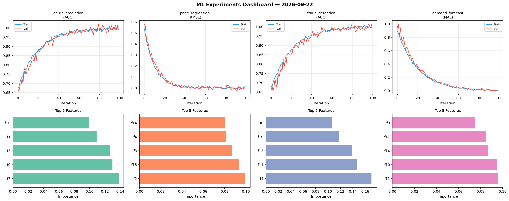
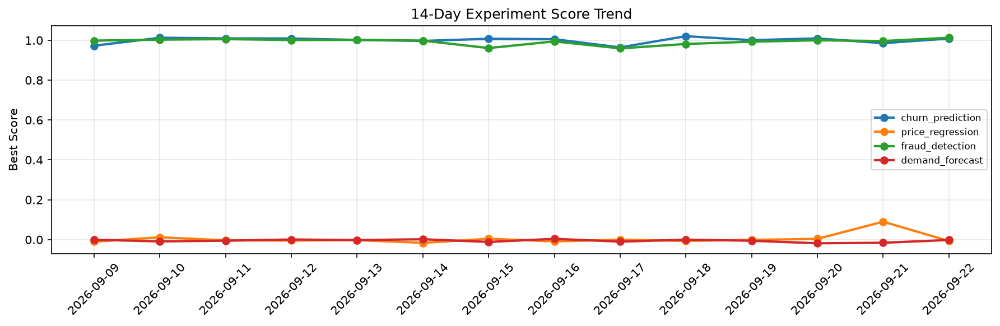

# ML Experiments Report — 2026-09-22

**Run ID:** `e5bb27bd85` | **Experiments:** 4 | **Trials:** 17

## Delta vs Yesterday

| Experiment | Today | Yesterday | Change |
|-----------|-------|-----------|--------|
| churn_prediction | 1.0087 | 0.9856 | 📈 2.3% |
| price_regression | -0.0069 | 0.0901 | 📉 -107.7% |
| fraud_detection | 1.0127 | 0.9963 | 📈 1.6% |
| demand_forecast | -0.0019 | -0.0157 | 📈 87.9% |

## churn_prediction (AUC)

**Best Score:** 1.0087 (Trial 4)

| Trial | Score | Overfit Gap | Time | LR | Trees | Leaves |
|-------|-------|-------------|------|-----|-------|--------|
| 1 | 0.9978 | 0.0027 | 26.25s | 0.2 | 100 | 127 |
| 2 | 0.9819 | 0.0235 | 95.47s | 0.2 | 500 | 63 |
| 3 | 0.9974 | 0.0 | 142.65s | 0.2 | 500 | 31 |
| 4 ⭐ | 1.0087 | 0.02 | 11.64s | 0.1 | 100 | 127 |

## price_regression (RMSE)

**Best Score:** -0.0069 (Trial 4)

| Trial | Score | Overfit Gap | Time | LR | Trees | Leaves |
|-------|-------|-------------|------|-----|-------|--------|
| 1 | 0.6927 | 0.0149 | 110.89s | 0.01 | 1000 | 15 |
| 2 | 1.3242 | 0.2003 | 51.22s | 0.01 | 200 | 31 |
| 3 | 0.0181 | 0.0178 | 21.55s | 0.1 | 100 | 15 |
| 4 ⭐ | -0.0069 | 0.0087 | 212.83s | 0.2 | 1000 | 31 |

## fraud_detection (AUC)

**Best Score:** 1.0127 (Trial 1)

| Trial | Score | Overfit Gap | Time | LR | Trees | Leaves |
|-------|-------|-------------|------|-----|-------|--------|
| 1 ⭐ | 1.0127 | 0.0162 | 122.96s | 0.1 | 1000 | 15 |
| 2 | 0.9738 | 0.0243 | 51.62s | 0.1 | 200 | 15 |
| 3 | 0.9558 | 0.0061 | 20.37s | 0.05 | 100 | 63 |
| 4 | 0.9942 | 0.0 | 183.31s | 0.1 | 1000 | 63 |
| 5 | 1.0024 | 0.0058 | 11.72s | 0.2 | 100 | 15 |

## demand_forecast (MAE)

**Best Score:** -0.0019 (Trial 1)

| Trial | Score | Overfit Gap | Time | LR | Trees | Leaves |
|-------|-------|-------------|------|-----|-------|--------|
| 1 ⭐ | -0.0019 | 0.0048 | 25.97s | 0.1 | 100 | 31 |
| 2 | 0.0089 | 0.0052 | 74.53s | 0.2 | 500 | 15 |
| 3 | 0.0612 | 0.0002 | 77.26s | 0.05 | 1000 | 63 |
| 4 | 0.0218 | 0.0125 | 111.6s | 0.1 | 1000 | 15 |
