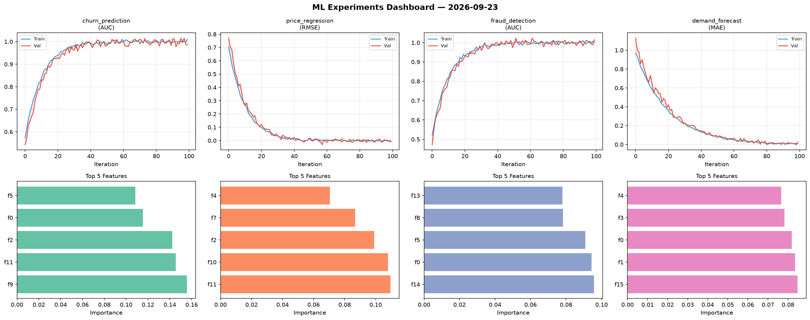
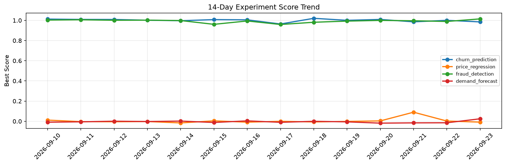

# ML Experiments Report — 2026-09-23

**Run ID:** `8e893aa806` | **Experiments:** 4 | **Trials:** 16

## Delta vs Yesterday

| Experiment | Today | Yesterday | Change |
|-----------|-------|-----------|--------|
| churn_prediction | 0.985 | 1.0006 | 📉 -1.6% |
| price_regression | -0.0083 | 0.0024 | 📉 -445.8% |
| fraud_detection | 1.0149 | 0.9894 | 📈 2.6% |
| demand_forecast | 0.0247 | -0.0147 | 📈 268.0% |

## churn_prediction (AUC)

**Best Score:** 0.985 (Trial 1)

| Trial | Score | Overfit Gap | Time | LR | Trees | Leaves |
|-------|-------|-------------|------|-----|-------|--------|
| 1 ⭐ | 0.985 | 0.0257 | 12.53s | 0.2 | 100 | 127 |
| 2 | 0.9447 | 0.0282 | 291.65s | 0.05 | 1000 | 127 |
| 3 | 0.937 | 0.0224 | 275.59s | 0.05 | 1000 | 127 |
| 4 | 0.6999 | 0.0149 | 206.75s | 0.01 | 1000 | 63 |

## price_regression (RMSE)

**Best Score:** -0.0083 (Trial 1)

| Trial | Score | Overfit Gap | Time | LR | Trees | Leaves |
|-------|-------|-------------|------|-----|-------|--------|
| 1 ⭐ | -0.0083 | 0.0045 | 143.94s | 0.2 | 1000 | 31 |
| 2 | 0.1515 | 0.0036 | 115.35s | 0.05 | 1000 | 31 |
| 3 | 0.0009 | 0.0005 | 4.93s | 0.2 | 100 | 127 |
| 4 | 0.1415 | 0.0011 | 22.92s | 0.05 | 100 | 63 |

## fraud_detection (AUC)

**Best Score:** 1.0149 (Trial 1)

| Trial | Score | Overfit Gap | Time | LR | Trees | Leaves |
|-------|-------|-------------|------|-----|-------|--------|
| 1 ⭐ | 1.0149 | 0.0131 | 99.63s | 0.2 | 500 | 127 |
| 2 | 0.777 | 0.013 | 23.27s | 0.01 | 200 | 15 |
| 3 | 0.9498 | 0.0055 | 116.78s | 0.05 | 500 | 15 |
| 4 | 0.8004 | 0.0032 | 34.5s | 0.01 | 500 | 63 |

## demand_forecast (MAE)

**Best Score:** 0.0247 (Trial 2)

| Trial | Score | Overfit Gap | Time | LR | Trees | Leaves |
|-------|-------|-------------|------|-----|-------|--------|
| 1 | 0.5709 | 0.0446 | 26.83s | 0.01 | 100 | 15 |
| 2 ⭐ | 0.0247 | 0.0085 | 52.86s | 0.1 | 200 | 127 |
| 3 | 1.1319 | 0.0617 | 82.65s | 0.01 | 1000 | 31 |
| 4 | 1.1277 | 0.0576 | 34.93s | 0.01 | 500 | 15 |
