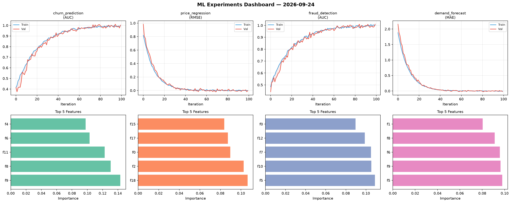
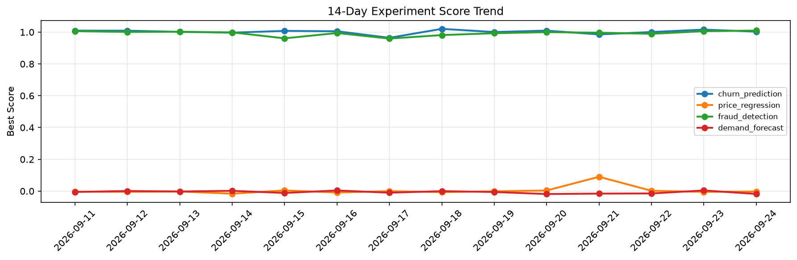

# ML Experiments Report — 2026-09-24

**Run ID:** `68bb2c4196` | **Experiments:** 4 | **Trials:** 19

## Delta vs Yesterday

| Experiment | Today | Yesterday | Change |
|-----------|-------|-----------|--------|
| churn_prediction | 1.0029 | 1.0159 | 📉 -1.3% |
| price_regression | -0.0025 | -0.005 | 📈 50.0% |
| fraud_detection | 1.0098 | 1.0058 | 📈 0.4% |
| demand_forecast | -0.0178 | 0.0042 | 📉 -523.8% |

## churn_prediction (AUC)

**Best Score:** 1.0029 (Trial 6)

| Trial | Score | Overfit Gap | Time | LR | Trees | Leaves |
|-------|-------|-------------|------|-----|-------|--------|
| 1 | 0.9613 | 0.001 | 44.03s | 0.05 | 200 | 31 |
| 2 | 0.9665 | 0.0102 | 49.21s | 0.05 | 500 | 15 |
| 3 | 0.9529 | 0.0093 | 13.96s | 0.05 | 100 | 127 |
| 4 | 0.9804 | 0.0108 | 203.63s | 0.1 | 1000 | 127 |
| 5 | 0.6797 | 0.0017 | 13.52s | 0.01 | 200 | 31 |
| 6 ⭐ | 1.0029 | 0.0078 | 4.27s | 0.1 | 100 | 127 |

## price_regression (RMSE)

**Best Score:** -0.0025 (Trial 2)

| Trial | Score | Overfit Gap | Time | LR | Trees | Leaves |
|-------|-------|-------------|------|-----|-------|--------|
| 1 | 0.8799 | 0.1001 | 25.7s | 0.01 | 500 | 31 |
| 2 ⭐ | -0.0025 | 0.0009 | 10.82s | 0.2 | 100 | 31 |
| 3 | 1.0606 | 0.1358 | 1.93s | 0.01 | 100 | 63 |

## fraud_detection (AUC)

**Best Score:** 1.0098 (Trial 6)

| Trial | Score | Overfit Gap | Time | LR | Trees | Leaves |
|-------|-------|-------------|------|-----|-------|--------|
| 1 | 0.9648 | 0.0088 | 57.83s | 0.05 | 500 | 15 |
| 2 | 0.6545 | 0.0051 | 51.4s | 0.01 | 500 | 63 |
| 3 | 1.0073 | 0.0086 | 22.45s | 0.2 | 500 | 63 |
| 4 | 0.9659 | 0.0037 | 122.3s | 0.05 | 500 | 31 |
| 5 | 0.9873 | 0.0054 | 27.82s | 0.1 | 100 | 63 |
| 6 ⭐ | 1.0098 | 0.0084 | 246.03s | 0.1 | 1000 | 15 |

## demand_forecast (MAE)

**Best Score:** -0.0178 (Trial 3)

| Trial | Score | Overfit Gap | Time | LR | Trees | Leaves |
|-------|-------|-------------|------|-----|-------|--------|
| 1 | 0.1932 | 0.028 | 5.26s | 0.05 | 100 | 31 |
| 2 | 0.0041 | 0.0006 | 39.47s | 0.2 | 1000 | 31 |
| 3 ⭐ | -0.0178 | 0.0175 | 11.88s | 0.2 | 200 | 15 |
| 4 | 0.0808 | 0.0105 | 16.01s | 0.05 | 200 | 127 |
