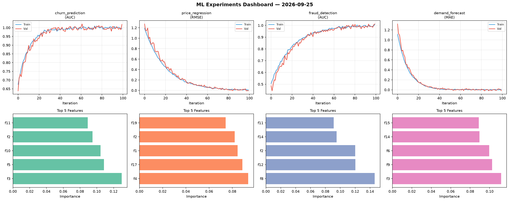
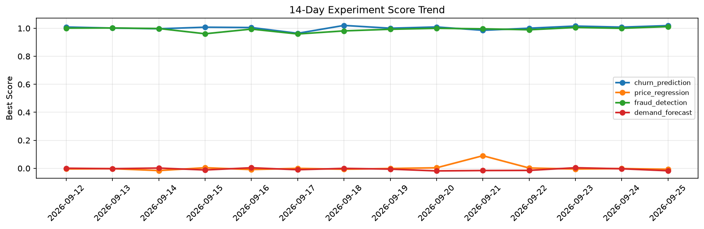

# ML Experiments Report — 2026-09-25

**Run ID:** `2ad02888bf` | **Experiments:** 4 | **Trials:** 16

## Delta vs Yesterday

| Experiment | Today | Yesterday | Change |
|-----------|-------|-----------|--------|
| churn_prediction | 1.0191 | 1.0083 | 📈 1.1% |
| price_regression | -0.0069 | -0.0016 | 📉 -331.2% |
| fraud_detection | 1.0121 | 0.9998 | 📈 1.2% |
| demand_forecast | -0.0173 | -0.0032 | 📉 -440.6% |

## churn_prediction (AUC)

**Best Score:** 1.0191 (Trial 2)

| Trial | Score | Overfit Gap | Time | LR | Trees | Leaves |
|-------|-------|-------------|------|-----|-------|--------|
| 1 | 1.0007 | 0.0007 | 6.38s | 0.2 | 200 | 31 |
| 2 ⭐ | 1.0191 | 0.0251 | 18.51s | 0.2 | 200 | 63 |
| 3 | 0.9577 | 0.0054 | 17.37s | 0.05 | 100 | 15 |

## price_regression (RMSE)

**Best Score:** -0.0069 (Trial 4)

| Trial | Score | Overfit Gap | Time | LR | Trees | Leaves |
|-------|-------|-------------|------|-----|-------|--------|
| 1 | 0.009 | 0.0003 | 8.35s | 0.1 | 200 | 31 |
| 2 | 0.0138 | 0.0098 | 15.72s | 0.2 | 500 | 63 |
| 3 | 0.0008 | 0.0033 | 4.14s | 0.2 | 100 | 127 |
| 4 ⭐ | -0.0069 | 0.0165 | 105.78s | 0.1 | 1000 | 31 |
| 5 | 0.9779 | 0.0842 | 113.55s | 0.01 | 500 | 31 |

## fraud_detection (AUC)

**Best Score:** 1.0121 (Trial 1)

| Trial | Score | Overfit Gap | Time | LR | Trees | Leaves |
|-------|-------|-------------|------|-----|-------|--------|
| 1 ⭐ | 1.0121 | 0.0012 | 266.87s | 0.1 | 1000 | 127 |
| 2 | 0.9952 | 0.0068 | 246.96s | 0.2 | 1000 | 31 |
| 3 | 0.5737 | 0.0839 | 71.04s | 0.01 | 500 | 15 |
| 4 | 0.9566 | 0.011 | 36.36s | 0.05 | 500 | 31 |

## demand_forecast (MAE)

**Best Score:** -0.0173 (Trial 1)

| Trial | Score | Overfit Gap | Time | LR | Trees | Leaves |
|-------|-------|-------------|------|-----|-------|--------|
| 1 ⭐ | -0.0173 | 0.0259 | 133.45s | 0.2 | 1000 | 127 |
| 2 | 0.5169 | 0.0507 | 23.0s | 0.01 | 100 | 127 |
| 3 | 0.0069 | 0.0048 | 48.66s | 0.1 | 1000 | 127 |
| 4 | 0.0071 | 0.0095 | 61.98s | 0.1 | 500 | 31 |
