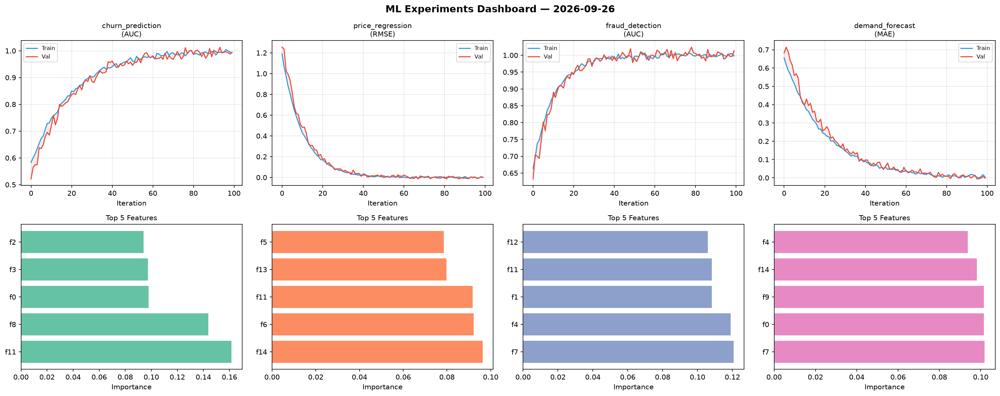
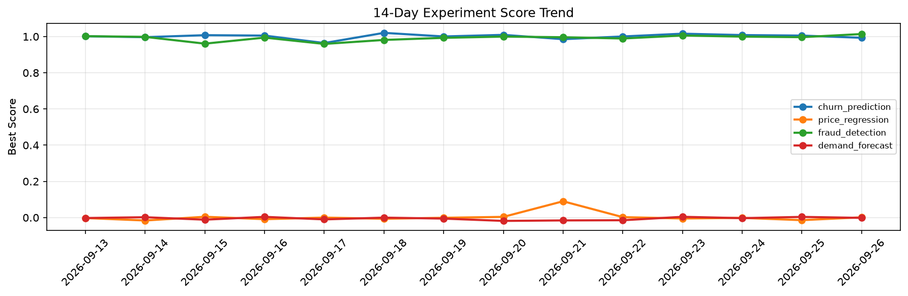

# ML Experiments Report — 2026-09-26

**Run ID:** `d739a727bd` | **Experiments:** 4 | **Trials:** 18

## Delta vs Yesterday

| Experiment | Today | Yesterday | Change |
|-----------|-------|-----------|--------|
| churn_prediction | 0.9933 | 1.0054 | 📉 -1.2% |
| price_regression | 0.0015 | -0.0142 | 📈 110.6% |
| fraud_detection | 1.014 | 0.9967 | 📈 1.7% |
| demand_forecast | -0.0017 | 0.0037 | 📉 -145.9% |

## churn_prediction (AUC)

**Best Score:** 0.9933 (Trial 3)

| Trial | Score | Overfit Gap | Time | LR | Trees | Leaves |
|-------|-------|-------------|------|-----|-------|--------|
| 1 | 0.9486 | 0.0051 | 69.56s | 0.05 | 1000 | 63 |
| 2 | 0.7069 | 0.0315 | 80.95s | 0.01 | 500 | 63 |
| 3 ⭐ | 0.9933 | 0.0003 | 27.13s | 0.1 | 100 | 63 |

## price_regression (RMSE)

**Best Score:** 0.0015 (Trial 2)

| Trial | Score | Overfit Gap | Time | LR | Trees | Leaves |
|-------|-------|-------------|------|-----|-------|--------|
| 1 | 0.0298 | 0.017 | 200.65s | 0.1 | 1000 | 63 |
| 2 ⭐ | 0.0015 | 0.0021 | 39.83s | 0.2 | 200 | 127 |
| 3 | 0.1092 | 0.0028 | 8.53s | 0.05 | 100 | 127 |
| 4 | 0.0099 | 0.0021 | 67.07s | 0.1 | 500 | 15 |
| 5 | 1.111 | 0.075 | 14.01s | 0.01 | 100 | 31 |

## fraud_detection (AUC)

**Best Score:** 1.014 (Trial 5)

| Trial | Score | Overfit Gap | Time | LR | Trees | Leaves |
|-------|-------|-------------|------|-----|-------|--------|
| 1 | 0.9885 | 0.013 | 32.53s | 0.2 | 200 | 63 |
| 2 | 1.0006 | 0.0008 | 74.44s | 0.1 | 500 | 63 |
| 3 | 1.0017 | 0.0113 | 158.97s | 0.1 | 1000 | 127 |
| 4 | 0.7214 | 0.0323 | 40.37s | 0.01 | 500 | 127 |
| 5 ⭐ | 1.014 | 0.0164 | 142.25s | 0.2 | 500 | 31 |
| 6 | 0.997 | 0.004 | 269.31s | 0.1 | 1000 | 63 |

## demand_forecast (MAE)

**Best Score:** -0.0017 (Trial 4)

| Trial | Score | Overfit Gap | Time | LR | Trees | Leaves |
|-------|-------|-------------|------|-----|-------|--------|
| 1 | 0.0089 | 0.004 | 12.21s | 0.1 | 100 | 31 |
| 2 | 0.0722 | 0.0136 | 11.69s | 0.05 | 200 | 31 |
| 3 | 0.0861 | 0.0158 | 55.91s | 0.05 | 200 | 15 |
| 4 ⭐ | -0.0017 | 0.0054 | 20.1s | 0.1 | 100 | 63 |
