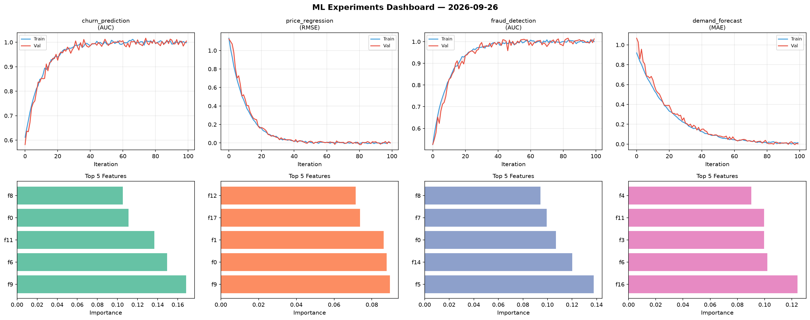
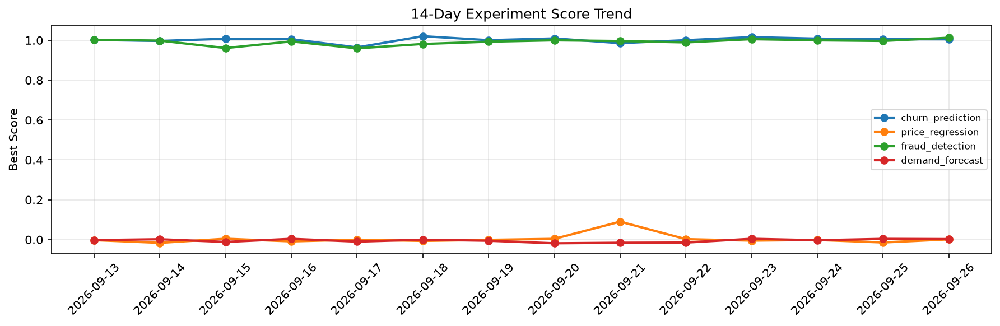

# ML Experiments Report — 2026-09-26

**Run ID:** `99444b630d` | **Experiments:** 4 | **Trials:** 20

## Delta vs Yesterday

| Experiment | Today | Yesterday | Change |
|-----------|-------|-----------|--------|
| churn_prediction | 1.005 | 1.0054 | 📉 -0.0% |
| price_regression | 0.0013 | -0.0142 | 📈 109.2% |
| fraud_detection | 1.0128 | 0.9967 | 📈 1.6% |
| demand_forecast | 0.0026 | 0.0037 | 📉 -29.7% |

## churn_prediction (AUC)

**Best Score:** 1.005 (Trial 4)

| Trial | Score | Overfit Gap | Time | LR | Trees | Leaves |
|-------|-------|-------------|------|-----|-------|--------|
| 1 | 0.7625 | 0.033 | 56.95s | 0.01 | 200 | 31 |
| 2 | 0.9395 | 0.0137 | 36.02s | 0.05 | 200 | 63 |
| 3 | 0.7862 | 0.0305 | 32.58s | 0.01 | 200 | 31 |
| 4 ⭐ | 1.005 | 0.0069 | 26.37s | 0.2 | 500 | 127 |
| 5 | 0.7061 | 0.0292 | 70.2s | 0.01 | 1000 | 31 |
| 6 | 0.9835 | 0.0057 | 17.77s | 0.1 | 100 | 127 |

## price_regression (RMSE)

**Best Score:** 0.0013 (Trial 4)

| Trial | Score | Overfit Gap | Time | LR | Trees | Leaves |
|-------|-------|-------------|------|-----|-------|--------|
| 1 | 0.8014 | 0.0246 | 19.33s | 0.01 | 100 | 63 |
| 2 | 0.0618 | 0.0114 | 27.41s | 0.05 | 200 | 127 |
| 3 | 0.3927 | 0.0518 | 100.46s | 0.01 | 500 | 31 |
| 4 ⭐ | 0.0013 | 0.0024 | 32.52s | 0.2 | 500 | 127 |
| 5 | 0.0304 | 0.0162 | 26.89s | 0.05 | 100 | 63 |

## fraud_detection (AUC)

**Best Score:** 1.0128 (Trial 3)

| Trial | Score | Overfit Gap | Time | LR | Trees | Leaves |
|-------|-------|-------------|------|-----|-------|--------|
| 1 | 0.9576 | 0.0114 | 148.75s | 0.05 | 500 | 31 |
| 2 | 1.008 | 0.0118 | 53.14s | 0.1 | 200 | 127 |
| 3 ⭐ | 1.0128 | 0.0129 | 38.54s | 0.2 | 200 | 31 |
| 4 | 1.0053 | 0.0068 | 29.51s | 0.2 | 100 | 31 |
| 5 | 0.9937 | 0.0051 | 148.94s | 0.1 | 500 | 15 |
| 6 | 0.987 | 0.0131 | 217.27s | 0.1 | 1000 | 15 |

## demand_forecast (MAE)

**Best Score:** 0.0026 (Trial 2)

| Trial | Score | Overfit Gap | Time | LR | Trees | Leaves |
|-------|-------|-------------|------|-----|-------|--------|
| 1 | 0.9155 | 0.0789 | 213.81s | 0.01 | 1000 | 127 |
| 2 ⭐ | 0.0026 | 0.0123 | 51.32s | 0.1 | 200 | 127 |
| 3 | 0.0129 | 0.0014 | 17.98s | 0.2 | 500 | 127 |
