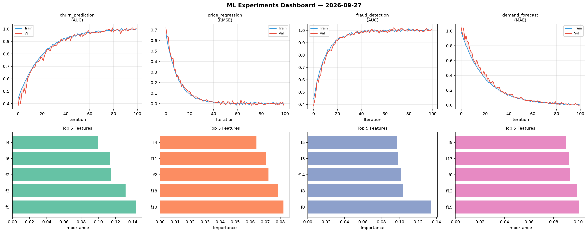
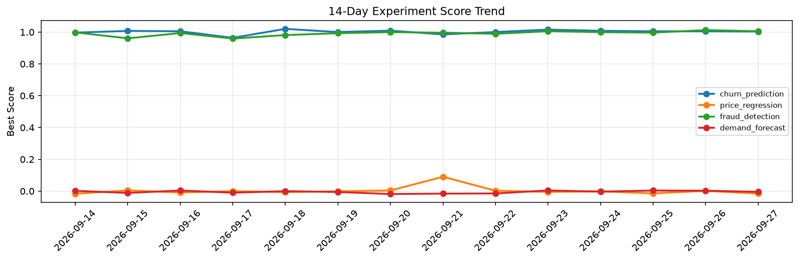

# ML Experiments Report — 2026-09-27

**Run ID:** `d7b0c91d2a` | **Experiments:** 4 | **Trials:** 18

## Delta vs Yesterday

| Experiment | Today | Yesterday | Change |
|-----------|-------|-----------|--------|
| churn_prediction | 1.0036 | 1.005 | 📉 -0.1% |
| price_regression | -0.0154 | 0.0013 | 📉 -1284.6% |
| fraud_detection | 1.0057 | 1.0128 | 📉 -0.7% |
| demand_forecast | -0.0045 | 0.0026 | 📉 -273.1% |

## churn_prediction (AUC)

**Best Score:** 1.0036 (Trial 1)

| Trial | Score | Overfit Gap | Time | LR | Trees | Leaves |
|-------|-------|-------------|------|-----|-------|--------|
| 1 ⭐ | 1.0036 | 0.0118 | 27.41s | 0.1 | 200 | 15 |
| 2 | 0.974 | 0.0204 | 21.97s | 0.1 | 100 | 63 |
| 3 | 0.6376 | 0.0524 | 17.3s | 0.01 | 100 | 63 |
| 4 | 0.6364 | 0.0229 | 13.96s | 0.01 | 100 | 15 |

## price_regression (RMSE)

**Best Score:** -0.0154 (Trial 4)

| Trial | Score | Overfit Gap | Time | LR | Trees | Leaves |
|-------|-------|-------------|------|-----|-------|--------|
| 1 | 0.0027 | 0.007 | 188.44s | 0.1 | 1000 | 63 |
| 2 | 0.6873 | 0.079 | 278.94s | 0.01 | 1000 | 31 |
| 3 | 0.1266 | 0.0213 | 29.54s | 0.05 | 100 | 63 |
| 4 ⭐ | -0.0154 | 0.0237 | 145.43s | 0.2 | 500 | 63 |

## fraud_detection (AUC)

**Best Score:** 1.0057 (Trial 1)

| Trial | Score | Overfit Gap | Time | LR | Trees | Leaves |
|-------|-------|-------------|------|-----|-------|--------|
| 1 ⭐ | 1.0057 | 0.002 | 43.23s | 0.2 | 200 | 15 |
| 2 | 0.9828 | 0.0122 | 53.48s | 0.2 | 200 | 63 |
| 3 | 0.9974 | 0.0047 | 5.7s | 0.2 | 200 | 31 |
| 4 | 0.9917 | 0.0012 | 141.54s | 0.1 | 500 | 127 |

## demand_forecast (MAE)

**Best Score:** -0.0045 (Trial 3)

| Trial | Score | Overfit Gap | Time | LR | Trees | Leaves |
|-------|-------|-------------|------|-----|-------|--------|
| 1 | 0.5149 | 0.0159 | 25.54s | 0.01 | 100 | 15 |
| 2 | 0.0035 | 0.005 | 3.66s | 0.2 | 100 | 63 |
| 3 ⭐ | -0.0045 | 0.0108 | 57.77s | 0.1 | 200 | 127 |
| 4 | 0.0138 | 0.0129 | 127.16s | 0.2 | 1000 | 31 |
| 5 | 0.0052 | 0.0002 | 18.47s | 0.2 | 100 | 127 |
| 6 | 0.155 | 0.0068 | 137.8s | 0.05 | 500 | 63 |
