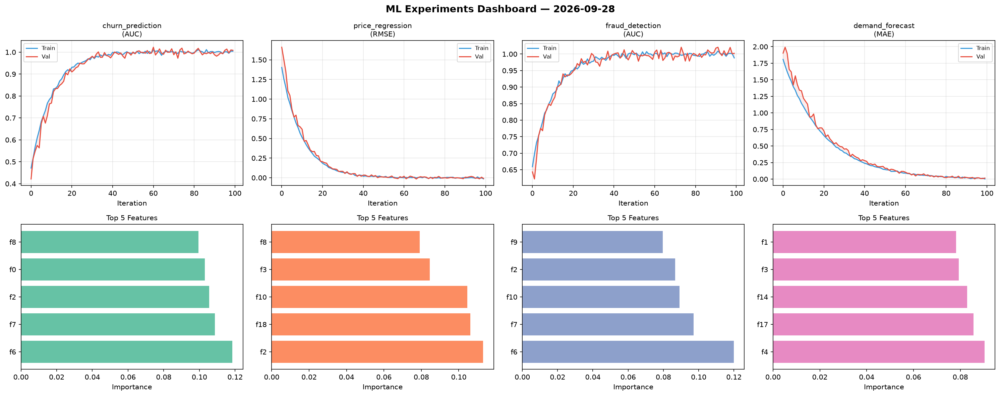
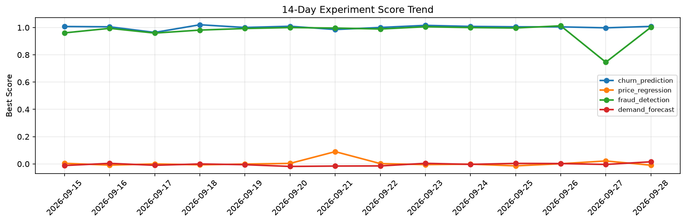

# ML Experiments Report — 2026-09-28

**Run ID:** `540eb0ac78` | **Experiments:** 4 | **Trials:** 21

## Delta vs Yesterday

| Experiment | Today | Yesterday | Change |
|-----------|-------|-----------|--------|
| churn_prediction | 1.0084 | 0.998 | 📈 1.0% |
| price_regression | -0.0095 | 0.0218 | 📉 -143.6% |
| fraud_detection | 1.0022 | 0.7458 | 📈 34.4% |
| demand_forecast | 0.0156 | -0.0038 | 📈 510.5% |

## churn_prediction (AUC)

**Best Score:** 1.0084 (Trial 1)

| Trial | Score | Overfit Gap | Time | LR | Trees | Leaves |
|-------|-------|-------------|------|-----|-------|--------|
| 1 ⭐ | 1.0084 | 0.0041 | 23.79s | 0.2 | 100 | 15 |
| 2 | 0.9796 | 0.0074 | 52.98s | 0.05 | 200 | 15 |
| 3 | 0.6326 | 0.0692 | 15.67s | 0.01 | 100 | 127 |
| 4 | 0.9464 | 0.0168 | 10.73s | 0.05 | 200 | 63 |
| 5 | 0.9689 | 0.0009 | 34.57s | 0.05 | 200 | 15 |
| 6 | 0.985 | 0.0139 | 23.25s | 0.1 | 100 | 31 |

## price_regression (RMSE)

**Best Score:** -0.0095 (Trial 1)

| Trial | Score | Overfit Gap | Time | LR | Trees | Leaves |
|-------|-------|-------------|------|-----|-------|--------|
| 1 ⭐ | -0.0095 | 0.0042 | 10.52s | 0.2 | 200 | 127 |
| 2 | 0.9238 | 0.1358 | 26.11s | 0.01 | 100 | 31 |
| 3 | 0.1155 | 0.0138 | 4.14s | 0.05 | 100 | 63 |
| 4 | -0.0036 | 0.0048 | 18.85s | 0.2 | 200 | 15 |
| 5 | 0.1428 | 0.0129 | 288.03s | 0.05 | 1000 | 63 |
| 6 | -0.0023 | 0.0009 | 19.71s | 0.2 | 1000 | 127 |

## fraud_detection (AUC)

**Best Score:** 1.0022 (Trial 1)

| Trial | Score | Overfit Gap | Time | LR | Trees | Leaves |
|-------|-------|-------------|------|-----|-------|--------|
| 1 ⭐ | 1.0022 | 0.0139 | 86.55s | 0.2 | 500 | 63 |
| 2 | 0.9563 | 0.0095 | 55.42s | 0.05 | 1000 | 15 |
| 3 | 0.9972 | 0.0022 | 44.7s | 0.1 | 200 | 63 |
| 4 | 0.7899 | 0.0159 | 59.45s | 0.01 | 200 | 63 |
| 5 | 0.6371 | 0.0216 | 12.08s | 0.01 | 100 | 127 |

## demand_forecast (MAE)

**Best Score:** 0.0156 (Trial 1)

| Trial | Score | Overfit Gap | Time | LR | Trees | Leaves |
|-------|-------|-------------|------|-----|-------|--------|
| 1 ⭐ | 0.0156 | 0.0136 | 59.26s | 0.1 | 200 | 127 |
| 2 | 0.6987 | 0.078 | 27.26s | 0.01 | 200 | 31 |
| 3 | 0.0751 | 0.001 | 30.66s | 0.05 | 200 | 127 |
| 4 | 0.0731 | 0.0109 | 46.13s | 0.05 | 200 | 127 |
