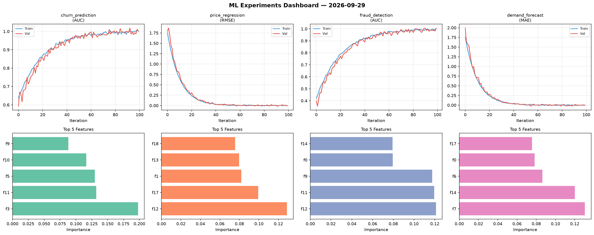
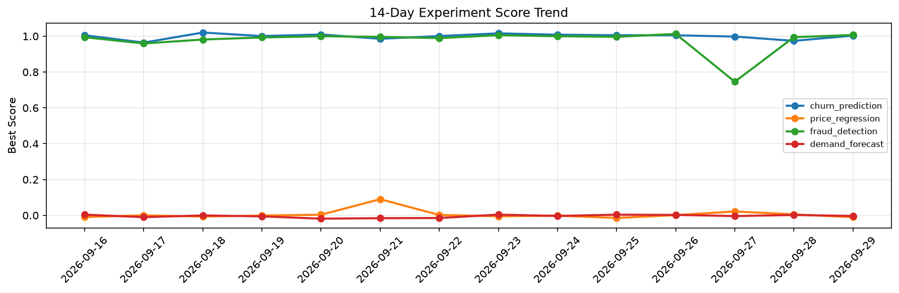

# ML Experiments Report — 2026-09-29

**Run ID:** `5a9b53f4cd` | **Experiments:** 4 | **Trials:** 22

## Delta vs Yesterday

| Experiment | Today | Yesterday | Change |
|-----------|-------|-----------|--------|
| churn_prediction | 1.0034 | 0.974 | 📈 3.0% |
| price_regression | -0.0102 | 0.0055 | 📉 -285.5% |
| fraud_detection | 1.0068 | 0.9947 | 📈 1.2% |
| demand_forecast | -0.0031 | 0.0021 | 📉 -247.6% |

## churn_prediction (AUC)

**Best Score:** 1.0034 (Trial 3)

| Trial | Score | Overfit Gap | Time | LR | Trees | Leaves |
|-------|-------|-------------|------|-----|-------|--------|
| 1 | 0.6582 | 0.0272 | 27.44s | 0.01 | 200 | 127 |
| 2 | 0.7951 | 0.0056 | 243.84s | 0.01 | 1000 | 15 |
| 3 ⭐ | 1.0034 | 0.0035 | 25.78s | 0.1 | 500 | 31 |
| 4 | 0.9579 | 0.0011 | 43.3s | 0.05 | 200 | 127 |
| 5 | 0.9948 | 0.0101 | 1.73s | 0.1 | 100 | 63 |
| 6 | 0.9629 | 0.0064 | 98.65s | 0.05 | 500 | 127 |

## price_regression (RMSE)

**Best Score:** -0.0102 (Trial 3)

| Trial | Score | Overfit Gap | Time | LR | Trees | Leaves |
|-------|-------|-------------|------|-----|-------|--------|
| 1 | 0.4941 | 0.0296 | 19.29s | 0.01 | 100 | 31 |
| 2 | 0.0012 | 0.0115 | 22.72s | 0.1 | 200 | 63 |
| 3 ⭐ | -0.0102 | 0.0057 | 128.86s | 0.2 | 1000 | 31 |
| 4 | 0.0172 | 0.0067 | 1.58s | 0.1 | 100 | 15 |
| 5 | 0.1109 | 0.0099 | 26.79s | 0.05 | 200 | 63 |
| 6 | 0.0071 | 0.0097 | 12.16s | 0.2 | 100 | 63 |

## fraud_detection (AUC)

**Best Score:** 1.0068 (Trial 3)

| Trial | Score | Overfit Gap | Time | LR | Trees | Leaves |
|-------|-------|-------------|------|-----|-------|--------|
| 1 | 0.9495 | 0.0201 | 272.84s | 0.05 | 1000 | 15 |
| 2 | 0.7782 | 0.0215 | 56.87s | 0.01 | 200 | 127 |
| 3 ⭐ | 1.0068 | 0.0032 | 16.19s | 0.1 | 100 | 31 |
| 4 | 0.9513 | 0.0066 | 15.77s | 0.05 | 500 | 31 |

## demand_forecast (MAE)

**Best Score:** -0.0031 (Trial 6)

| Trial | Score | Overfit Gap | Time | LR | Trees | Leaves |
|-------|-------|-------------|------|-----|-------|--------|
| 1 | 0.0028 | 0.0093 | 74.92s | 0.2 | 500 | 63 |
| 2 | 1.2542 | 0.1803 | 1.31s | 0.01 | 100 | 15 |
| 3 | 0.0105 | 0.0099 | 11.88s | 0.1 | 100 | 63 |
| 4 | 0.0115 | 0.009 | 224.12s | 0.1 | 1000 | 15 |
| 5 | 0.5096 | 0.0892 | 96.22s | 0.01 | 1000 | 31 |
| 6 ⭐ | -0.0031 | 0.001 | 47.21s | 0.2 | 200 | 31 |
