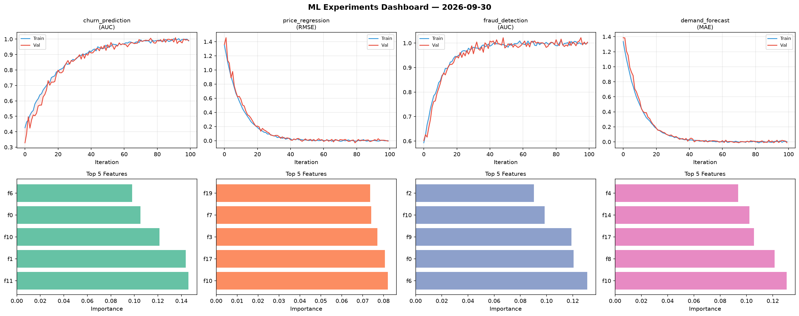
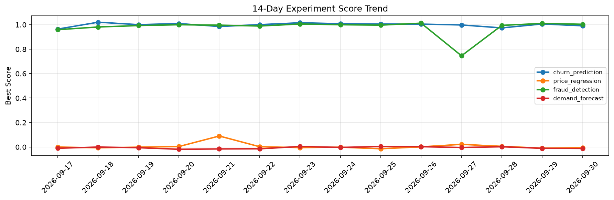

# ML Experiments Report — 2026-09-30

**Run ID:** `36afbb3e6d` | **Experiments:** 4 | **Trials:** 18

## Delta vs Yesterday

| Experiment | Today | Yesterday | Change |
|-----------|-------|-----------|--------|
| churn_prediction | 0.9911 | 1.006 | 📉 -1.5% |
| price_regression | -0.0058 | -0.0093 | 📈 37.6% |
| fraud_detection | 1.0036 | 1.0104 | 📉 -0.7% |
| demand_forecast | -0.012 | -0.0106 | 📉 -13.2% |

## churn_prediction (AUC)

**Best Score:** 0.9911 (Trial 1)

| Trial | Score | Overfit Gap | Time | LR | Trees | Leaves |
|-------|-------|-------------|------|-----|-------|--------|
| 1 ⭐ | 0.9911 | 0.0031 | 50.6s | 0.1 | 500 | 63 |
| 2 | 0.9361 | 0.0135 | 253.82s | 0.05 | 1000 | 31 |
| 3 | 0.7276 | 0.004 | 199.31s | 0.01 | 1000 | 127 |

## price_regression (RMSE)

**Best Score:** -0.0058 (Trial 3)

| Trial | Score | Overfit Gap | Time | LR | Trees | Leaves |
|-------|-------|-------------|------|-----|-------|--------|
| 1 | 0.1986 | 0.0325 | 50.8s | 0.05 | 200 | 127 |
| 2 | 0.111 | 0.0155 | 35.44s | 0.05 | 200 | 31 |
| 3 ⭐ | -0.0058 | 0.0058 | 53.88s | 0.2 | 200 | 63 |

## fraud_detection (AUC)

**Best Score:** 1.0036 (Trial 1)

| Trial | Score | Overfit Gap | Time | LR | Trees | Leaves |
|-------|-------|-------------|------|-----|-------|--------|
| 1 ⭐ | 1.0036 | 0.0028 | 40.04s | 0.2 | 200 | 127 |
| 2 | 0.9916 | 0.0082 | 51.71s | 0.1 | 200 | 127 |
| 3 | 1.0006 | 0.0027 | 17.34s | 0.1 | 200 | 15 |
| 4 | 0.9529 | 0.0023 | 33.14s | 0.05 | 500 | 63 |
| 5 | 1.0025 | 0.0042 | 28.17s | 0.2 | 100 | 63 |
| 6 | 0.7018 | 0.0064 | 160.73s | 0.01 | 1000 | 63 |

## demand_forecast (MAE)

**Best Score:** -0.012 (Trial 5)

| Trial | Score | Overfit Gap | Time | LR | Trees | Leaves |
|-------|-------|-------------|------|-----|-------|--------|
| 1 | 0.0939 | 0.0339 | 27.81s | 0.05 | 100 | 63 |
| 2 | 0.013 | 0.016 | 5.44s | 0.1 | 100 | 31 |
| 3 | 0.0206 | 0.0122 | 3.71s | 0.1 | 200 | 15 |
| 4 | 0.6843 | 0.1128 | 202.35s | 0.01 | 1000 | 127 |
| 5 ⭐ | -0.012 | 0.0169 | 47.04s | 0.2 | 200 | 15 |
| 6 | 0.9523 | 0.0018 | 80.71s | 0.01 | 500 | 127 |
