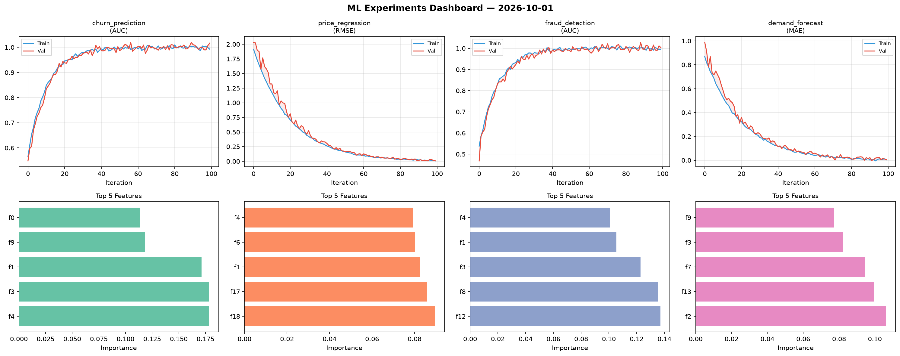
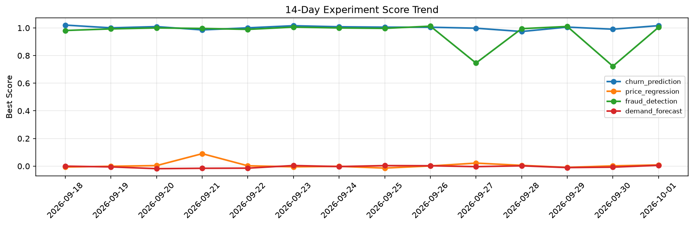

# ML Experiments Report — 2026-10-01

**Run ID:** `2ae2453a62` | **Experiments:** 4 | **Trials:** 18

## Delta vs Yesterday

| Experiment | Today | Yesterday | Change |
|-----------|-------|-----------|--------|
| churn_prediction | 1.0164 | 0.9907 | 📈 2.6% |
| price_regression | 0.0086 | 0.0018 | 📈 377.8% |
| fraud_detection | 1.0043 | 0.7229 | 📈 38.9% |
| demand_forecast | 0.0056 | -0.0074 | 📈 175.7% |

## churn_prediction (AUC)

**Best Score:** 1.0164 (Trial 4)

| Trial | Score | Overfit Gap | Time | LR | Trees | Leaves |
|-------|-------|-------------|------|-----|-------|--------|
| 1 | 0.7884 | 0.0062 | 170.02s | 0.01 | 1000 | 63 |
| 2 | 0.7575 | 0.0311 | 50.89s | 0.01 | 200 | 15 |
| 3 | 1.0003 | 0.0083 | 85.75s | 0.1 | 1000 | 15 |
| 4 ⭐ | 1.0164 | 0.0233 | 1.45s | 0.2 | 100 | 15 |
| 5 | 0.6405 | 0.0304 | 20.04s | 0.01 | 100 | 63 |
| 6 | 0.9905 | 0.0122 | 91.99s | 0.1 | 500 | 63 |

## price_regression (RMSE)

**Best Score:** 0.0086 (Trial 2)

| Trial | Score | Overfit Gap | Time | LR | Trees | Leaves |
|-------|-------|-------------|------|-----|-------|--------|
| 1 | 0.8654 | 0.0624 | 11.77s | 0.01 | 200 | 31 |
| 2 ⭐ | 0.0086 | 0.0013 | 25.61s | 0.1 | 100 | 31 |
| 3 | 0.1023 | 0.0025 | 60.57s | 0.05 | 500 | 127 |

## fraud_detection (AUC)

**Best Score:** 1.0043 (Trial 4)

| Trial | Score | Overfit Gap | Time | LR | Trees | Leaves |
|-------|-------|-------------|------|-----|-------|--------|
| 1 | 0.989 | 0.0073 | 58.94s | 0.1 | 500 | 127 |
| 2 | 0.6768 | 0.0052 | 22.42s | 0.01 | 100 | 15 |
| 3 | 0.7257 | 0.0578 | 297.44s | 0.01 | 1000 | 63 |
| 4 ⭐ | 1.0043 | 0.0098 | 8.69s | 0.2 | 100 | 63 |
| 5 | 0.6331 | 0.0394 | 28.97s | 0.01 | 100 | 127 |
| 6 | 0.7097 | 0.0107 | 13.95s | 0.01 | 100 | 63 |

## demand_forecast (MAE)

**Best Score:** 0.0056 (Trial 1)

| Trial | Score | Overfit Gap | Time | LR | Trees | Leaves |
|-------|-------|-------------|------|-----|-------|--------|
| 1 ⭐ | 0.0056 | 0.0016 | 100.4s | 0.1 | 500 | 15 |
| 2 | 0.166 | 0.0035 | 14.59s | 0.05 | 1000 | 15 |
| 3 | 0.0491 | 0.0091 | 9.41s | 0.05 | 500 | 63 |
