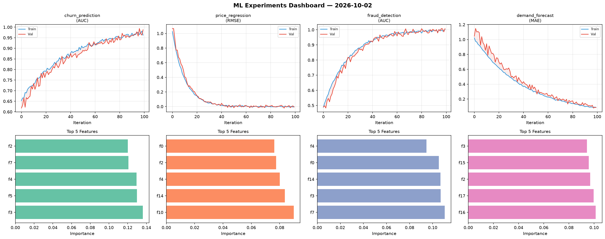
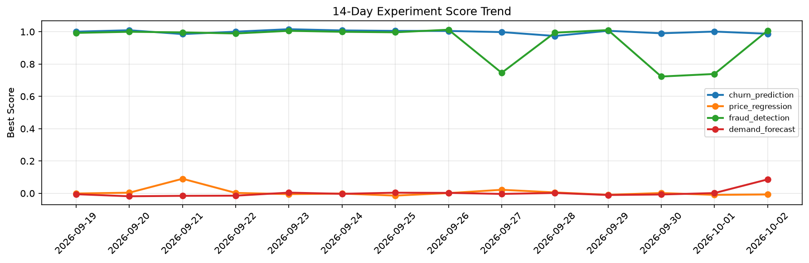

# ML Experiments Report — 2026-10-02

**Run ID:** `a5e0f1296d` | **Experiments:** 4 | **Trials:** 17

## Delta vs Yesterday

| Experiment | Today | Yesterday | Change |
|-----------|-------|-----------|--------|
| churn_prediction | 0.9878 | 1.0012 | 📉 -1.3% |
| price_regression | -0.0072 | -0.0097 | 📈 25.8% |
| fraud_detection | 1.0073 | 0.7388 | 📈 36.3% |
| demand_forecast | 0.0861 | 0.0015 | 📈 5640.0% |

## churn_prediction (AUC)

**Best Score:** 0.9878 (Trial 1)

| Trial | Score | Overfit Gap | Time | LR | Trees | Leaves |
|-------|-------|-------------|------|-----|-------|--------|
| 1 ⭐ | 0.9878 | 0.0255 | 51.44s | 0.05 | 1000 | 63 |
| 2 | 0.9709 | 0.0187 | 83.69s | 0.05 | 500 | 31 |
| 3 | 0.6958 | 0.0467 | 81.0s | 0.01 | 500 | 15 |
| 4 | 0.9463 | 0.0127 | 49.72s | 0.05 | 1000 | 15 |

## price_regression (RMSE)

**Best Score:** -0.0072 (Trial 5)

| Trial | Score | Overfit Gap | Time | LR | Trees | Leaves |
|-------|-------|-------------|------|-----|-------|--------|
| 1 | -0.0041 | 0.0042 | 74.3s | 0.2 | 500 | 63 |
| 2 | 0.373 | 0.0006 | 94.6s | 0.01 | 500 | 63 |
| 3 | 0.0102 | 0.0024 | 10.38s | 0.2 | 200 | 63 |
| 4 | 0.0085 | 0.0079 | 17.18s | 0.1 | 100 | 31 |
| 5 ⭐ | -0.0072 | 0.0071 | 83.15s | 0.2 | 500 | 127 |

## fraud_detection (AUC)

**Best Score:** 1.0073 (Trial 4)

| Trial | Score | Overfit Gap | Time | LR | Trees | Leaves |
|-------|-------|-------------|------|-----|-------|--------|
| 1 | 0.9709 | 0.0006 | 28.09s | 0.05 | 1000 | 31 |
| 2 | 1.0026 | 0.0096 | 125.52s | 0.1 | 500 | 127 |
| 3 | 0.9973 | 0.0009 | 28.41s | 0.1 | 100 | 127 |
| 4 ⭐ | 1.0073 | 0.0066 | 9.21s | 0.1 | 100 | 31 |

## demand_forecast (MAE)

**Best Score:** 0.0861 (Trial 1)

| Trial | Score | Overfit Gap | Time | LR | Trees | Leaves |
|-------|-------|-------------|------|-----|-------|--------|
| 1 ⭐ | 0.0861 | 0.0029 | 38.02s | 0.05 | 200 | 127 |
| 2 | 0.0889 | 0.0235 | 136.25s | 0.05 | 500 | 63 |
| 3 | 0.9119 | 0.1115 | 15.66s | 0.01 | 100 | 127 |
| 4 | 0.1416 | 0.0137 | 36.34s | 0.05 | 500 | 63 |
