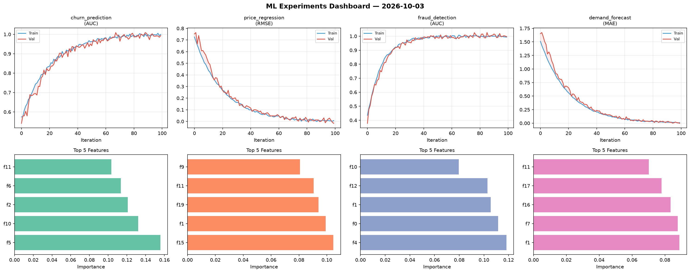
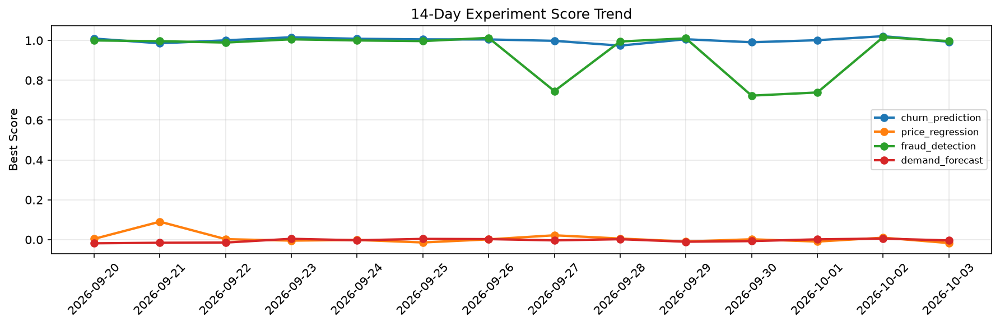

# ML Experiments Report — 2026-10-03

**Run ID:** `b265a85c84` | **Experiments:** 4 | **Trials:** 17

## Delta vs Yesterday

| Experiment | Today | Yesterday | Change |
|-----------|-------|-----------|--------|
| churn_prediction | 0.9934 | 1.0213 | 📉 -2.7% |
| price_regression | -0.0172 | 0.0098 | 📉 -275.5% |
| fraud_detection | 0.9967 | 1.0165 | 📉 -1.9% |
| demand_forecast | -0.0041 | 0.0053 | 📉 -177.4% |

## churn_prediction (AUC)

**Best Score:** 0.9934 (Trial 2)

| Trial | Score | Overfit Gap | Time | LR | Trees | Leaves |
|-------|-------|-------------|------|-----|-------|--------|
| 1 | 0.9911 | 0.0118 | 284.42s | 0.1 | 1000 | 63 |
| 2 ⭐ | 0.9934 | 0.0061 | 66.26s | 0.1 | 500 | 31 |
| 3 | 0.7464 | 0.0435 | 18.47s | 0.01 | 100 | 31 |
| 4 | 0.9932 | 0.0088 | 25.43s | 0.1 | 100 | 31 |
| 5 | 0.9934 | 0.0015 | 9.84s | 0.2 | 500 | 63 |

## price_regression (RMSE)

**Best Score:** -0.0172 (Trial 1)

| Trial | Score | Overfit Gap | Time | LR | Trees | Leaves |
|-------|-------|-------------|------|-----|-------|--------|
| 1 ⭐ | -0.0172 | 0.0246 | 27.76s | 0.1 | 200 | 63 |
| 2 | 0.8035 | 0.1427 | 4.04s | 0.01 | 100 | 127 |
| 3 | -0.0056 | 0.0002 | 29.4s | 0.2 | 200 | 63 |

## fraud_detection (AUC)

**Best Score:** 0.9967 (Trial 2)

| Trial | Score | Overfit Gap | Time | LR | Trees | Leaves |
|-------|-------|-------------|------|-----|-------|--------|
| 1 | 0.9477 | 0.0012 | 27.5s | 0.05 | 100 | 31 |
| 2 ⭐ | 0.9967 | 0.0029 | 81.23s | 0.2 | 500 | 31 |
| 3 | 0.9658 | 0.0018 | 20.24s | 0.05 | 500 | 15 |
| 4 | 0.9929 | 0.0039 | 4.82s | 0.1 | 200 | 127 |

## demand_forecast (MAE)

**Best Score:** -0.0041 (Trial 3)

| Trial | Score | Overfit Gap | Time | LR | Trees | Leaves |
|-------|-------|-------------|------|-----|-------|--------|
| 1 | 0.0281 | 0.0158 | 6.14s | 0.1 | 100 | 127 |
| 2 | 0.0812 | 0.0136 | 15.11s | 0.05 | 100 | 63 |
| 3 ⭐ | -0.0041 | 0.0158 | 113.14s | 0.1 | 1000 | 127 |
| 4 | 0.6361 | 0.0646 | 33.08s | 0.01 | 200 | 63 |
| 5 | 0.1183 | 0.0034 | 262.31s | 0.05 | 1000 | 127 |
