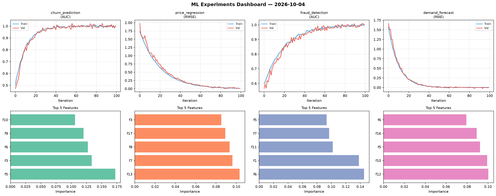
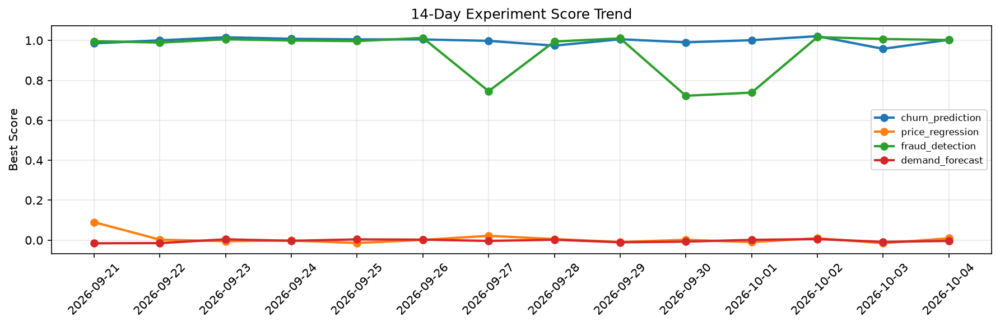

# ML Experiments Report — 2026-10-04

**Run ID:** `b435e0b35f` | **Experiments:** 4 | **Trials:** 17

## Delta vs Yesterday

| Experiment | Today | Yesterday | Change |
|-----------|-------|-----------|--------|
| churn_prediction | 1.0034 | 0.958 | 📈 4.7% |
| price_regression | 0.0092 | -0.015 | 📈 161.3% |
| fraud_detection | 1.0023 | 1.0074 | 📉 -0.5% |
| demand_forecast | -0.0038 | -0.0086 | 📈 55.8% |

## churn_prediction (AUC)

**Best Score:** 1.0034 (Trial 2)

| Trial | Score | Overfit Gap | Time | LR | Trees | Leaves |
|-------|-------|-------------|------|-----|-------|--------|
| 1 | 0.6208 | 0.0434 | 52.22s | 0.01 | 200 | 63 |
| 2 ⭐ | 1.0034 | 0.0089 | 25.57s | 0.2 | 100 | 63 |
| 3 | 0.9915 | 0.0029 | 168.43s | 0.1 | 1000 | 127 |

## price_regression (RMSE)

**Best Score:** 0.0092 (Trial 1)

| Trial | Score | Overfit Gap | Time | LR | Trees | Leaves |
|-------|-------|-------------|------|-----|-------|--------|
| 1 ⭐ | 0.0092 | 0.0029 | 91.98s | 0.1 | 1000 | 31 |
| 2 | 0.0131 | 0.0109 | 181.73s | 0.1 | 1000 | 63 |
| 3 | 0.4487 | 0.0548 | 106.8s | 0.01 | 500 | 31 |

## fraud_detection (AUC)

**Best Score:** 1.0023 (Trial 2)

| Trial | Score | Overfit Gap | Time | LR | Trees | Leaves |
|-------|-------|-------------|------|-----|-------|--------|
| 1 | 0.9815 | 0.022 | 21.53s | 0.2 | 100 | 63 |
| 2 ⭐ | 1.0023 | 0.01 | 21.69s | 0.1 | 1000 | 15 |
| 3 | 0.9827 | 0.0182 | 2.91s | 0.2 | 200 | 127 |
| 4 | 0.9518 | 0.0014 | 142.57s | 0.05 | 500 | 127 |
| 5 | 0.6366 | 0.0581 | 28.54s | 0.01 | 200 | 31 |
| 6 | 0.9757 | 0.0022 | 106.94s | 0.05 | 1000 | 127 |

## demand_forecast (MAE)

**Best Score:** -0.0038 (Trial 1)

| Trial | Score | Overfit Gap | Time | LR | Trees | Leaves |
|-------|-------|-------------|------|-----|-------|--------|
| 1 ⭐ | -0.0038 | 0.0118 | 143.5s | 0.2 | 500 | 63 |
| 2 | 0.7824 | 0.0604 | 139.18s | 0.01 | 500 | 31 |
| 3 | 0.0746 | 0.017 | 41.45s | 0.05 | 200 | 15 |
| 4 | 0.0108 | 0.0071 | 4.77s | 0.1 | 100 | 127 |
| 5 | 0.4841 | 0.0241 | 51.81s | 0.01 | 200 | 63 |
