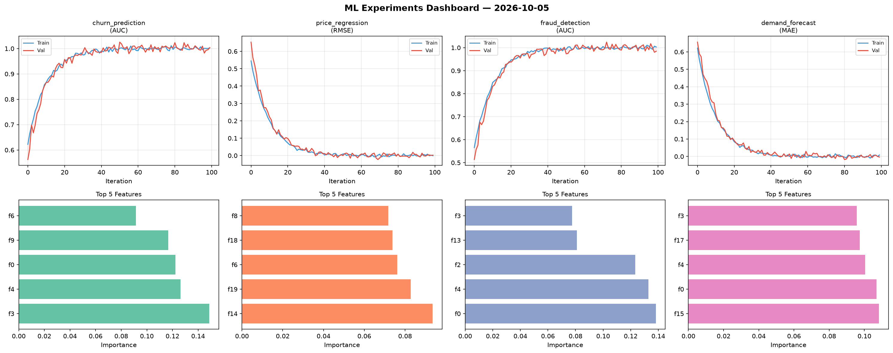
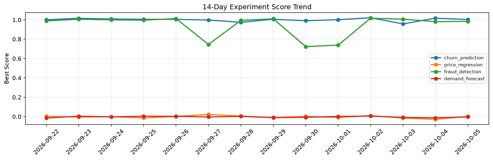

# ML Experiments Report — 2026-10-05

**Run ID:** `767c228ae9` | **Experiments:** 4 | **Trials:** 19

## Delta vs Yesterday

| Experiment | Today | Yesterday | Change |
|-----------|-------|-----------|--------|
| churn_prediction | 1.0035 | 1.0168 | 📉 -1.3% |
| price_regression | 0.0023 | -0.0292 | 📈 107.9% |
| fraud_detection | 0.9846 | 0.9803 | 📈 0.4% |
| demand_forecast | -0.0032 | -0.0129 | 📈 75.2% |

## churn_prediction (AUC)

**Best Score:** 1.0035 (Trial 1)

| Trial | Score | Overfit Gap | Time | LR | Trees | Leaves |
|-------|-------|-------------|------|-----|-------|--------|
| 1 ⭐ | 1.0035 | 0.0012 | 14.25s | 0.2 | 100 | 127 |
| 2 | 1.0005 | 0.0023 | 248.12s | 0.1 | 1000 | 15 |
| 3 | 0.7038 | 0.0298 | 16.52s | 0.01 | 200 | 31 |
| 4 | 0.9959 | 0.0114 | 49.51s | 0.2 | 200 | 127 |
| 5 | 0.9584 | 0.0013 | 36.94s | 0.05 | 500 | 127 |

## price_regression (RMSE)

**Best Score:** 0.0023 (Trial 2)

| Trial | Score | Overfit Gap | Time | LR | Trees | Leaves |
|-------|-------|-------------|------|-----|-------|--------|
| 1 | 0.0028 | 0.002 | 43.58s | 0.1 | 500 | 63 |
| 2 ⭐ | 0.0023 | 0.0031 | 29.51s | 0.2 | 100 | 63 |
| 3 | 0.174 | 0.0188 | 78.6s | 0.05 | 1000 | 31 |
| 4 | 0.0074 | 0.0055 | 13.34s | 0.2 | 500 | 15 |
| 5 | 0.1665 | 0.027 | 23.6s | 0.05 | 200 | 63 |
| 6 | 0.0778 | 0.0074 | 18.73s | 0.05 | 100 | 127 |

## fraud_detection (AUC)

**Best Score:** 0.9846 (Trial 1)

| Trial | Score | Overfit Gap | Time | LR | Trees | Leaves |
|-------|-------|-------------|------|-----|-------|--------|
| 1 ⭐ | 0.9846 | 0.0185 | 13.8s | 0.2 | 100 | 15 |
| 2 | 0.6601 | 0.0535 | 48.15s | 0.01 | 1000 | 127 |
| 3 | 0.9658 | 0.0048 | 37.55s | 0.05 | 200 | 31 |

## demand_forecast (MAE)

**Best Score:** -0.0032 (Trial 2)

| Trial | Score | Overfit Gap | Time | LR | Trees | Leaves |
|-------|-------|-------------|------|-----|-------|--------|
| 1 | 0.0755 | 0.0115 | 12.2s | 0.05 | 100 | 15 |
| 2 ⭐ | -0.0032 | 0.0117 | 27.41s | 0.2 | 100 | 127 |
| 3 | 0.0172 | 0.0155 | 11.19s | 0.2 | 200 | 127 |
| 4 | 0.0085 | 0.0022 | 2.88s | 0.1 | 200 | 31 |
| 5 | 0.0862 | 0.0154 | 84.91s | 0.05 | 500 | 127 |
