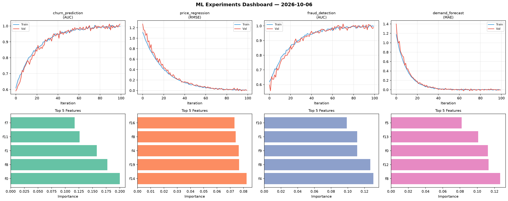
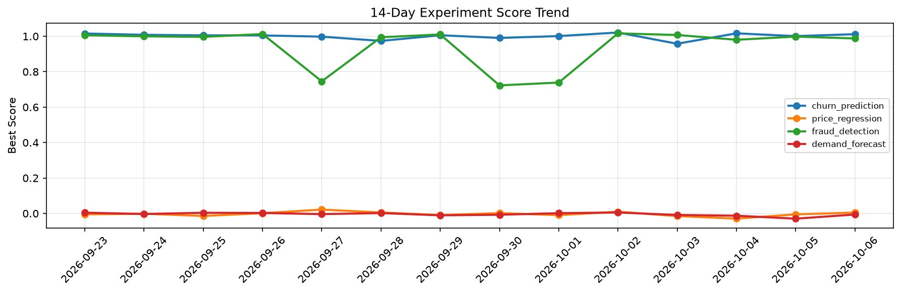

# ML Experiments Report — 2026-10-06

**Run ID:** `509293dc73` | **Experiments:** 4 | **Trials:** 19

## Delta vs Yesterday

| Experiment | Today | Yesterday | Change |
|-----------|-------|-----------|--------|
| churn_prediction | 1.012 | 1.001 | 📈 1.1% |
| price_regression | 0.0048 | -0.0052 | 📈 192.3% |
| fraud_detection | 0.9878 | 0.9983 | 📉 -1.1% |
| demand_forecast | -0.0061 | -0.0295 | 📈 79.3% |

## churn_prediction (AUC)

**Best Score:** 1.012 (Trial 2)

| Trial | Score | Overfit Gap | Time | LR | Trees | Leaves |
|-------|-------|-------------|------|-----|-------|--------|
| 1 | 1.0063 | 0.0085 | 20.53s | 0.2 | 200 | 31 |
| 2 ⭐ | 1.012 | 0.0147 | 6.25s | 0.1 | 200 | 31 |
| 3 | 0.978 | 0.0187 | 140.75s | 0.1 | 500 | 63 |

## price_regression (RMSE)

**Best Score:** 0.0048 (Trial 1)

| Trial | Score | Overfit Gap | Time | LR | Trees | Leaves |
|-------|-------|-------------|------|-----|-------|--------|
| 1 ⭐ | 0.0048 | 0.003 | 202.45s | 0.1 | 1000 | 15 |
| 2 | 1.1649 | 0.095 | 201.63s | 0.01 | 1000 | 31 |
| 3 | 0.6072 | 0.0861 | 13.63s | 0.01 | 100 | 31 |
| 4 | 0.3621 | 0.0458 | 41.48s | 0.01 | 200 | 63 |

## fraud_detection (AUC)

**Best Score:** 0.9878 (Trial 6)

| Trial | Score | Overfit Gap | Time | LR | Trees | Leaves |
|-------|-------|-------------|------|-----|-------|--------|
| 1 | 0.9592 | 0.0074 | 38.27s | 0.05 | 200 | 31 |
| 2 | 0.9465 | 0.0213 | 251.92s | 0.05 | 1000 | 31 |
| 3 | 0.9855 | 0.0121 | 30.59s | 0.1 | 200 | 127 |
| 4 | 0.751 | 0.0313 | 11.4s | 0.01 | 200 | 31 |
| 5 | 0.7259 | 0.0476 | 18.71s | 0.01 | 200 | 63 |
| 6 ⭐ | 0.9878 | 0.0091 | 65.59s | 0.1 | 1000 | 63 |

## demand_forecast (MAE)

**Best Score:** -0.0061 (Trial 2)

| Trial | Score | Overfit Gap | Time | LR | Trees | Leaves |
|-------|-------|-------------|------|-----|-------|--------|
| 1 | 0.1571 | 0.0117 | 155.37s | 0.05 | 1000 | 15 |
| 2 ⭐ | -0.0061 | 0.0039 | 61.47s | 0.2 | 500 | 15 |
| 3 | 0.2106 | 0.0368 | 21.84s | 0.05 | 500 | 15 |
| 4 | 0.5359 | 0.0947 | 93.13s | 0.01 | 500 | 15 |
| 5 | 0.8122 | 0.0253 | 56.6s | 0.01 | 200 | 15 |
| 6 | 0.0142 | 0.0046 | 219.74s | 0.1 | 1000 | 63 |
