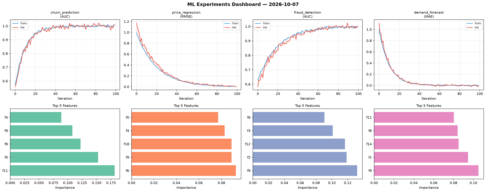
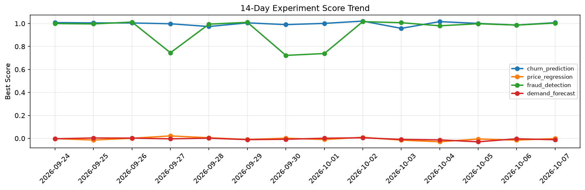

# ML Experiments Report — 2026-10-07

**Run ID:** `ec357e3bfb` | **Experiments:** 4 | **Trials:** 24

## Delta vs Yesterday

| Experiment | Today | Yesterday | Change |
|-----------|-------|-----------|--------|
| churn_prediction | 1.0074 | 0.9868 | 📈 2.1% |
| price_regression | -0.0011 | -0.0148 | 📈 92.6% |
| fraud_detection | 1.0042 | 0.9865 | 📈 1.8% |
| demand_forecast | -0.0115 | -0.0034 | 📉 -238.2% |

## churn_prediction (AUC)

**Best Score:** 1.0074 (Trial 3)

| Trial | Score | Overfit Gap | Time | LR | Trees | Leaves |
|-------|-------|-------------|------|-----|-------|--------|
| 1 | 0.6465 | 0.0038 | 76.24s | 0.01 | 500 | 127 |
| 2 | 0.9985 | 0.0009 | 53.64s | 0.2 | 200 | 31 |
| 3 ⭐ | 1.0074 | 0.0004 | 21.75s | 0.2 | 100 | 127 |
| 4 | 0.9893 | 0.0056 | 21.93s | 0.1 | 1000 | 127 |
| 5 | 0.986 | 0.0117 | 3.23s | 0.1 | 100 | 63 |
| 6 | 0.9893 | 0.009 | 247.87s | 0.2 | 1000 | 15 |

## price_regression (RMSE)

**Best Score:** -0.0011 (Trial 3)

| Trial | Score | Overfit Gap | Time | LR | Trees | Leaves |
|-------|-------|-------------|------|-----|-------|--------|
| 1 | 0.4949 | 0.0588 | 17.5s | 0.01 | 200 | 31 |
| 2 | 1.0305 | 0.0386 | 70.04s | 0.01 | 500 | 127 |
| 3 ⭐ | -0.0011 | 0.0032 | 22.71s | 0.1 | 100 | 31 |
| 4 | 0.0831 | 0.0075 | 21.07s | 0.05 | 100 | 127 |
| 5 | -0.0003 | 0.0099 | 110.85s | 0.1 | 1000 | 63 |
| 6 | 0.0076 | 0.0077 | 144.88s | 0.2 | 1000 | 127 |

## fraud_detection (AUC)

**Best Score:** 1.0042 (Trial 5)

| Trial | Score | Overfit Gap | Time | LR | Trees | Leaves |
|-------|-------|-------------|------|-----|-------|--------|
| 1 | 0.7513 | 0.0173 | 3.95s | 0.01 | 100 | 63 |
| 2 | 0.9989 | 0.0015 | 32.78s | 0.1 | 200 | 31 |
| 3 | 0.6002 | 0.0772 | 19.48s | 0.01 | 100 | 31 |
| 4 | 0.9977 | 0.0021 | 19.25s | 0.1 | 200 | 31 |
| 5 ⭐ | 1.0042 | 0.011 | 9.66s | 0.1 | 100 | 15 |
| 6 | 0.9586 | 0.0011 | 23.54s | 0.05 | 200 | 15 |

## demand_forecast (MAE)

**Best Score:** -0.0115 (Trial 1)

| Trial | Score | Overfit Gap | Time | LR | Trees | Leaves |
|-------|-------|-------------|------|-----|-------|--------|
| 1 ⭐ | -0.0115 | 0.0085 | 42.63s | 0.2 | 200 | 15 |
| 2 | 0.0108 | 0.002 | 54.6s | 0.1 | 200 | 15 |
| 3 | 0.0094 | 0.0061 | 18.54s | 0.1 | 100 | 31 |
| 4 | 0.7176 | 0.0029 | 295.92s | 0.01 | 1000 | 127 |
| 5 | 0.205 | 0.0382 | 19.24s | 0.05 | 500 | 15 |
| 6 | -0.0001 | 0.0101 | 3.51s | 0.2 | 200 | 15 |
