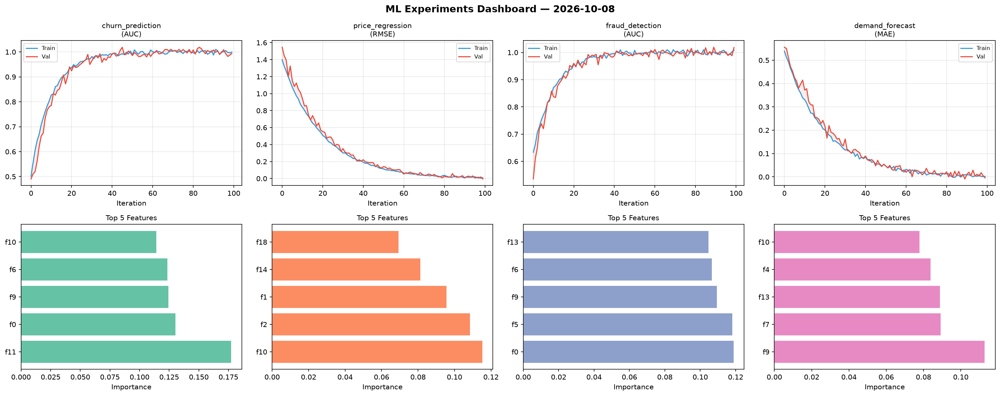
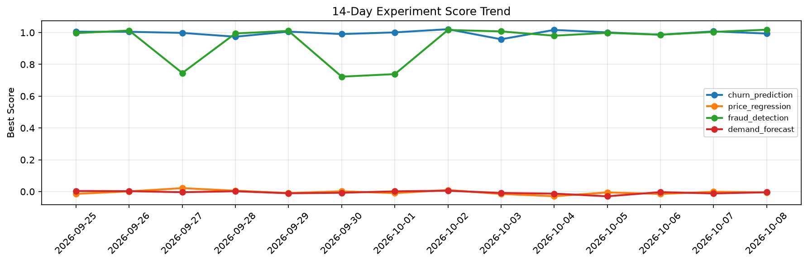

# ML Experiments Report — 2026-10-08

**Run ID:** `42962670e6` | **Experiments:** 4 | **Trials:** 16

## Delta vs Yesterday

| Experiment | Today | Yesterday | Change |
|-----------|-------|-----------|--------|
| churn_prediction | 0.994 | 1.0074 | 📉 -1.3% |
| price_regression | -0.0053 | -0.0011 | 📉 -381.8% |
| fraud_detection | 1.0181 | 1.0042 | 📈 1.4% |
| demand_forecast | -0.0043 | -0.0115 | 📈 62.6% |

## churn_prediction (AUC)

**Best Score:** 0.994 (Trial 1)

| Trial | Score | Overfit Gap | Time | LR | Trees | Leaves |
|-------|-------|-------------|------|-----|-------|--------|
| 1 ⭐ | 0.994 | 0.0052 | 57.75s | 0.2 | 200 | 15 |
| 2 | 0.7583 | 0.0241 | 10.69s | 0.01 | 100 | 31 |
| 3 | 0.9834 | 0.0191 | 273.83s | 0.2 | 1000 | 15 |

## price_regression (RMSE)

**Best Score:** -0.0053 (Trial 2)

| Trial | Score | Overfit Gap | Time | LR | Trees | Leaves |
|-------|-------|-------------|------|-----|-------|--------|
| 1 | 0.1263 | 0.0065 | 33.65s | 0.05 | 200 | 63 |
| 2 ⭐ | -0.0053 | 0.0149 | 6.69s | 0.1 | 200 | 127 |
| 3 | 0.5622 | 0.0487 | 124.71s | 0.01 | 500 | 63 |
| 4 | 0.1317 | 0.0334 | 41.13s | 0.05 | 1000 | 31 |

## fraud_detection (AUC)

**Best Score:** 1.0181 (Trial 3)

| Trial | Score | Overfit Gap | Time | LR | Trees | Leaves |
|-------|-------|-------------|------|-----|-------|--------|
| 1 | 0.9703 | 0.002 | 36.45s | 0.05 | 500 | 31 |
| 2 | 0.7199 | 0.0149 | 64.3s | 0.01 | 1000 | 15 |
| 3 ⭐ | 1.0181 | 0.0102 | 15.29s | 0.2 | 100 | 15 |
| 4 | 0.9423 | 0.0017 | 9.06s | 0.05 | 100 | 63 |

## demand_forecast (MAE)

**Best Score:** -0.0043 (Trial 2)

| Trial | Score | Overfit Gap | Time | LR | Trees | Leaves |
|-------|-------|-------------|------|-----|-------|--------|
| 1 | 0.0896 | 0.0098 | 47.0s | 0.05 | 200 | 63 |
| 2 ⭐ | -0.0043 | 0.0067 | 14.45s | 0.1 | 100 | 15 |
| 3 | 0.015 | 0.0199 | 68.05s | 0.2 | 1000 | 63 |
| 4 | 1.2942 | 0.1223 | 27.28s | 0.01 | 100 | 31 |
| 5 | 0.0012 | 0.0065 | 149.32s | 0.1 | 500 | 63 |
