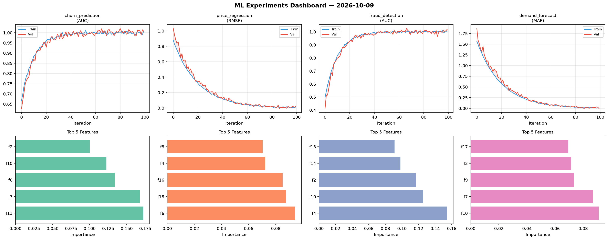
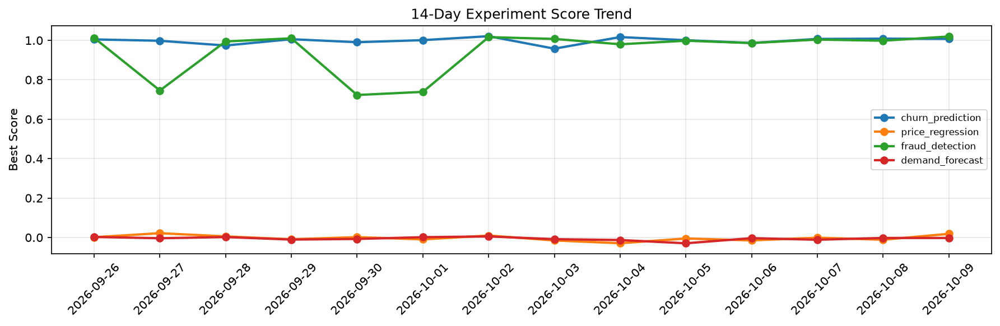

# ML Experiments Report — 2026-10-09

**Run ID:** `fb48916d78` | **Experiments:** 4 | **Trials:** 19

## Delta vs Yesterday

| Experiment | Today | Yesterday | Change |
|-----------|-------|-----------|--------|
| churn_prediction | 1.0077 | 1.0087 | 📉 -0.1% |
| price_regression | 0.0185 | -0.0115 | 📈 260.9% |
| fraud_detection | 1.0198 | 0.9983 | 📈 2.2% |
| demand_forecast | -0.0025 | -0.0024 | 📉 -4.2% |

## churn_prediction (AUC)

**Best Score:** 1.0077 (Trial 1)

| Trial | Score | Overfit Gap | Time | LR | Trees | Leaves |
|-------|-------|-------------|------|-----|-------|--------|
| 1 ⭐ | 1.0077 | 0.0017 | 21.03s | 0.2 | 500 | 15 |
| 2 | 0.6644 | 0.0487 | 91.15s | 0.01 | 500 | 31 |
| 3 | 0.6508 | 0.0096 | 57.16s | 0.01 | 200 | 63 |
| 4 | 0.997 | 0.0046 | 223.92s | 0.1 | 1000 | 31 |
| 5 | 0.7929 | 0.0209 | 21.1s | 0.01 | 200 | 31 |

## price_regression (RMSE)

**Best Score:** 0.0185 (Trial 1)

| Trial | Score | Overfit Gap | Time | LR | Trees | Leaves |
|-------|-------|-------------|------|-----|-------|--------|
| 1 ⭐ | 0.0185 | 0.007 | 39.67s | 0.1 | 200 | 127 |
| 2 | 0.1328 | 0.0052 | 32.47s | 0.05 | 200 | 15 |
| 3 | 1.2683 | 0.1541 | 22.06s | 0.01 | 100 | 63 |
| 4 | 0.1709 | 0.0012 | 85.76s | 0.05 | 500 | 31 |
| 5 | 1.1274 | 0.1317 | 105.52s | 0.01 | 500 | 127 |
| 6 | 0.0854 | 0.0033 | 4.23s | 0.05 | 200 | 63 |

## fraud_detection (AUC)

**Best Score:** 1.0198 (Trial 2)

| Trial | Score | Overfit Gap | Time | LR | Trees | Leaves |
|-------|-------|-------------|------|-----|-------|--------|
| 1 | 0.9923 | 0.0045 | 23.91s | 0.1 | 100 | 127 |
| 2 ⭐ | 1.0198 | 0.0207 | 134.76s | 0.2 | 1000 | 127 |
| 3 | 0.9772 | 0.0264 | 178.32s | 0.2 | 1000 | 127 |

## demand_forecast (MAE)

**Best Score:** -0.0025 (Trial 2)

| Trial | Score | Overfit Gap | Time | LR | Trees | Leaves |
|-------|-------|-------------|------|-----|-------|--------|
| 1 | 1.1801 | 0.1365 | 36.34s | 0.01 | 200 | 15 |
| 2 ⭐ | -0.0025 | 0.0108 | 190.99s | 0.1 | 1000 | 31 |
| 3 | -0.0012 | 0.0041 | 14.62s | 0.2 | 200 | 15 |
| 4 | 0.1794 | 0.0294 | 16.92s | 0.05 | 100 | 15 |
| 5 | 0.0133 | 0.0211 | 18.7s | 0.2 | 100 | 127 |
