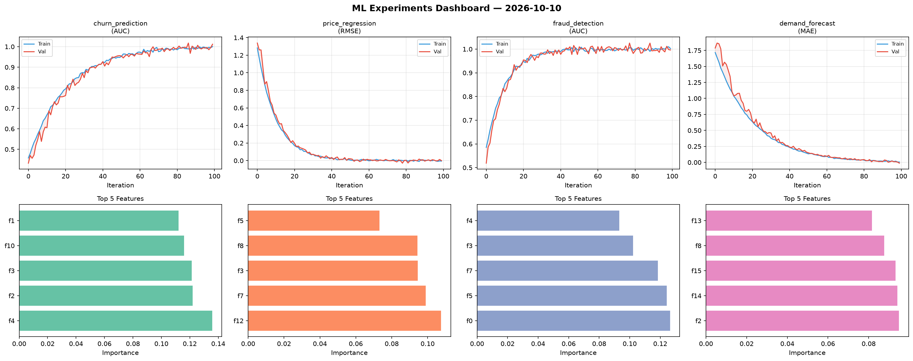
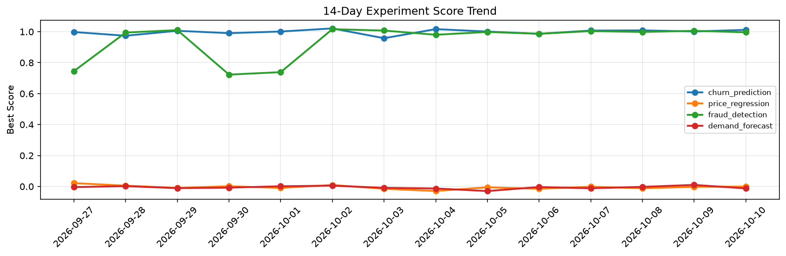

# ML Experiments Report — 2026-10-10

**Run ID:** `e4dc285f52` | **Experiments:** 4 | **Trials:** 19

## Delta vs Yesterday

| Experiment | Today | Yesterday | Change |
|-----------|-------|-----------|--------|
| churn_prediction | 1.012 | 1.0015 | 📈 1.0% |
| price_regression | -0.0005 | -0.0024 | 📈 79.2% |
| fraud_detection | 0.9963 | 1.0058 | 📉 -0.9% |
| demand_forecast | -0.0124 | 0.0102 | 📉 -221.6% |

## churn_prediction (AUC)

**Best Score:** 1.012 (Trial 5)

| Trial | Score | Overfit Gap | Time | LR | Trees | Leaves |
|-------|-------|-------------|------|-----|-------|--------|
| 1 | 0.9798 | 0.0088 | 17.13s | 0.05 | 100 | 63 |
| 2 | 0.9956 | 0.007 | 117.68s | 0.1 | 1000 | 63 |
| 3 | 1.0014 | 0.001 | 22.34s | 0.2 | 100 | 127 |
| 4 | 0.7925 | 0.0268 | 43.17s | 0.01 | 1000 | 63 |
| 5 ⭐ | 1.012 | 0.0117 | 7.45s | 0.1 | 200 | 63 |
| 6 | 1.0062 | 0.0134 | 4.82s | 0.1 | 100 | 63 |

## price_regression (RMSE)

**Best Score:** -0.0005 (Trial 2)

| Trial | Score | Overfit Gap | Time | LR | Trees | Leaves |
|-------|-------|-------------|------|-----|-------|--------|
| 1 | 0.0084 | 0.0005 | 5.8s | 0.1 | 100 | 127 |
| 2 ⭐ | -0.0005 | 0.005 | 40.73s | 0.2 | 200 | 15 |
| 3 | 0.1042 | 0.0023 | 22.66s | 0.05 | 100 | 127 |

## fraud_detection (AUC)

**Best Score:** 0.9963 (Trial 3)

| Trial | Score | Overfit Gap | Time | LR | Trees | Leaves |
|-------|-------|-------------|------|-----|-------|--------|
| 1 | 0.7968 | 0.0141 | 3.68s | 0.01 | 100 | 127 |
| 2 | 0.9847 | 0.0207 | 135.33s | 0.2 | 500 | 15 |
| 3 ⭐ | 0.9963 | 0.0063 | 150.29s | 0.2 | 1000 | 127 |
| 4 | 0.9871 | 0.0073 | 2.42s | 0.1 | 100 | 15 |

## demand_forecast (MAE)

**Best Score:** -0.0124 (Trial 3)

| Trial | Score | Overfit Gap | Time | LR | Trees | Leaves |
|-------|-------|-------------|------|-----|-------|--------|
| 1 | 0.0974 | 0.0074 | 21.9s | 0.05 | 1000 | 31 |
| 2 | 0.0007 | 0.001 | 52.51s | 0.2 | 1000 | 127 |
| 3 ⭐ | -0.0124 | 0.0177 | 18.41s | 0.1 | 500 | 15 |
| 4 | 0.0068 | 0.0101 | 6.61s | 0.1 | 200 | 31 |
| 5 | 0.0044 | 0.0051 | 31.49s | 0.1 | 1000 | 31 |
| 6 | 0.0049 | 0.0053 | 50.51s | 0.2 | 200 | 31 |
